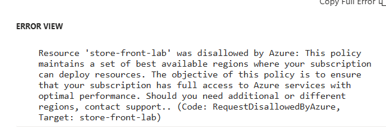

# CST8915-Lab3

## Youtube Link

https://youtu.be/wG8-J4mOX2U

## Reflection Questions

**1. What challenges did you encounter when configuring environment variables in the GitHub Actions workflow?**

Due to Azure limitations I am unable to use Static Web Apps for my store-front.

**2. How does deploying microservices on Azure Web App Service differ from running them locally?**

In my opinion, deploying microservices on Azure Web App Service is easier and faster since we don't have to 
set up the VM and deploy the microservices with a button. Adding the environment variables is fairly easy on the Azure portal. Continuous deployment is very helpful because we don't have to restart the application when making changes.

**3. Why is it important to use environment variables for configurations in a cloud environment?**

Using environment variables is important for configurations in cloud environment because it helps with scalability by making sure different instances have the correct configuration. It also separates the different environments such as development, testing, and deployment which aligns with the 12 Factor App method.

## Services Repositories

1. order-service: https://github.com/mend0214/order-service-lab2
2. product-service: https://github.com/mend0214/product-service-python
3. store-front: https://github.com/mend0214/store-front-lab2/tree/main/store-front